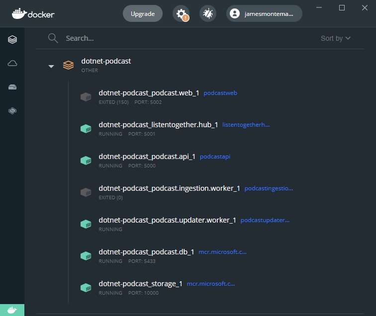

# .AI Sleep Podcasts

## Local Deployment Quickstart

The easiest way to get started is to build and run the .NET Podcasts app service, database, and storage using Docker. 

1. First install [Docker Desktop](https://www.docker.com/products/docker-desktop)
2. Clone the repository and navigate to the root directory in a terminal
3. Run the following docker command (this may take some time to pull images, build, and deploy locally)

```cli
docker-compose up
```

- *For Apple arm64-based system*:
```cli
docker-compose -f docker-compose.arm64.yml -f docker-compose.override.yml up
```

This will deploy and start all services required to run the web, mobile, and desktop apps. The Web API will run on `localhost:5003` and the SignalR Hub for listen together will run on `localhost:5001`.

### Web, Mobile, & Desktop

The apps are configured to speak to `localhost` on the correct ports for each service. Simply open the [Web solution](src/Web#solution) or the [.NET MAUI solution](src/Mobile) and run the app.

Ensure that you have the following services running in Docker (podcast.api, listentogether.hub, podcast.updater.worker, podcast.db, storage):



### Backend Services

Open the [Services solution](src/Services) and pick a service to run locally such as the `Podcast.API`.

Ensure that the following services are running in Docker, note that you only need the `podcast.db` and `storage`:


## Local Deployment with Visual Studio

1. First install [Docker Desktop](https://www.docker.com/products/docker-desktop)
2. Clone the repository and navigate to the root directory in a terminal
3. Open the solution `NetPodcast.sln`, set the start project to `docker-compose` and hit F5. To optimize debugging while running all services, please refer to [Launch a subset of Compose services documentation.](https://docs.microsoft.com/visualstudio/containers/launch-profiles)
4. By default, the Podcast.Api's swagger endpoint will be launched. Navigate to `localhost:5002` for the web application. If you see any errors, wait for a while and refresh the page.