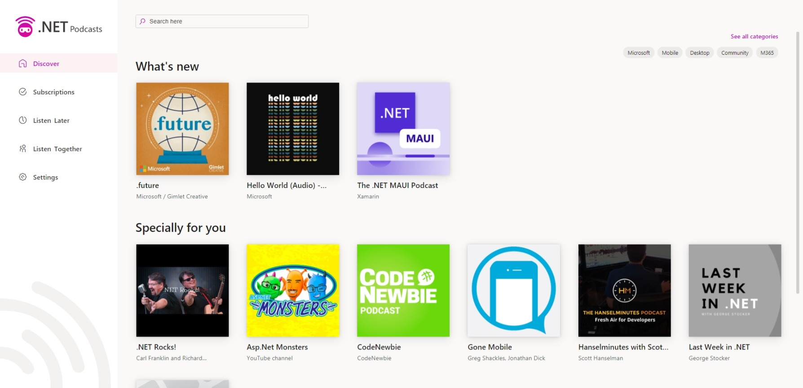
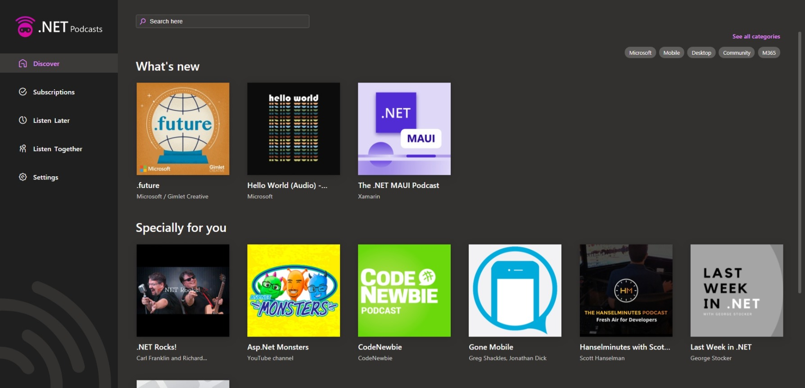
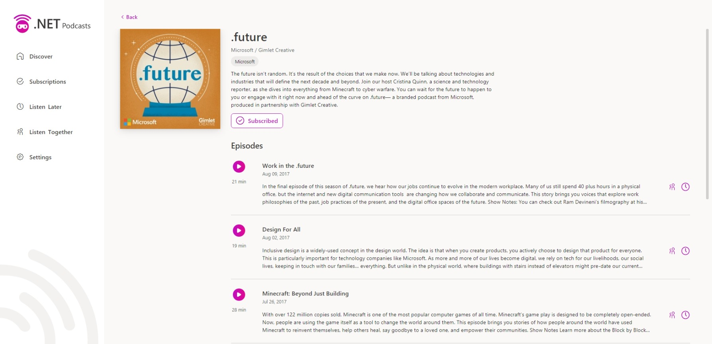
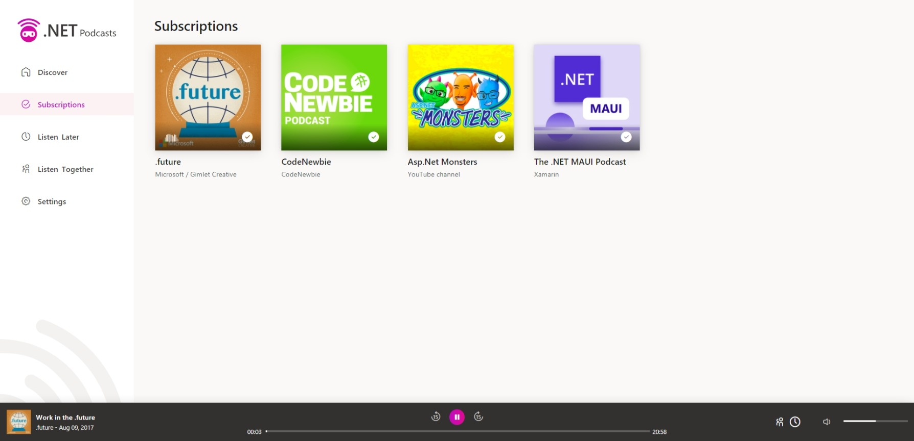
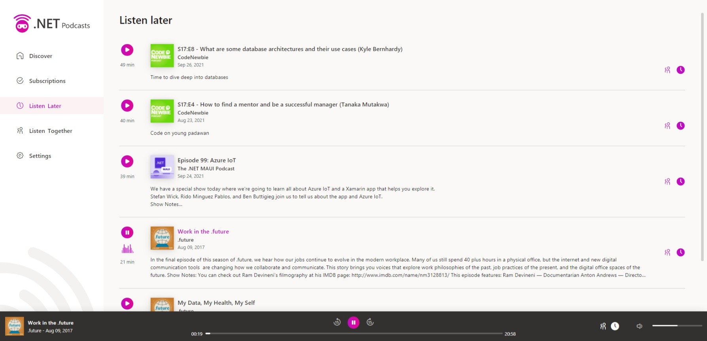
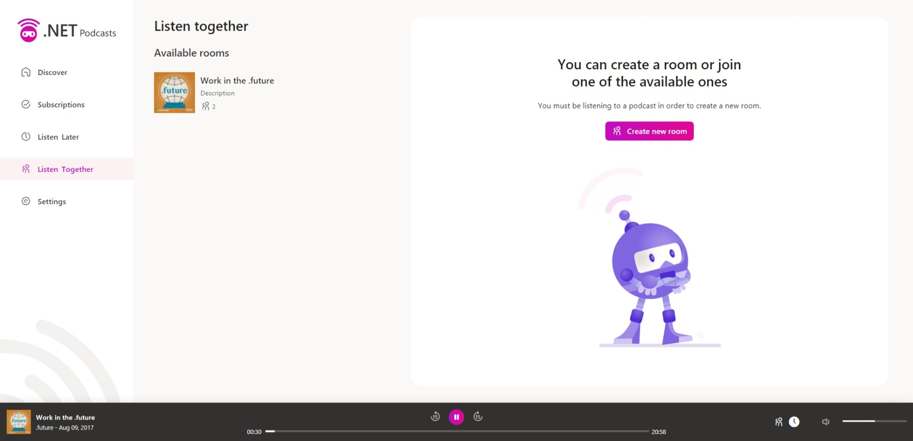
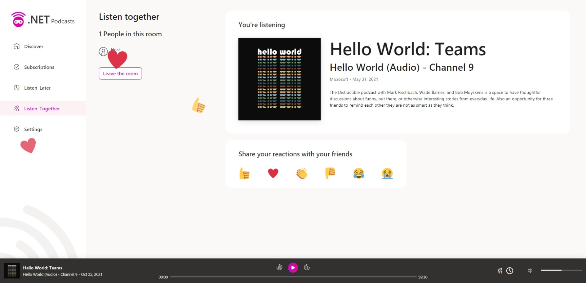
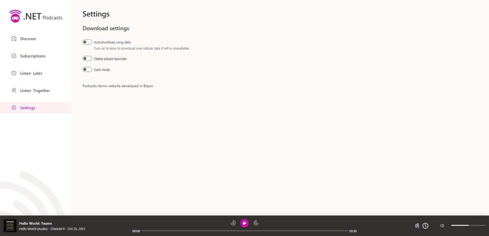

# AISleepod Website


## Deploy to Azure

With the following ARM template you can automate the creation of the resources for this website.

[](https://portal.azure.com/#create/Microsoft.Template/uri/https://raw.githubusercontent.com/microsoft/dotnet-podcasts/main/deploy/Web/web.json)

## Run website locally

### Docker Compose

The easiest way to run your backend services locally is using **Docker Compose**. To run the services type `docker-compose up` from terminal located in the root folder. This will build (if needed) the Docker images and bring up all the containers.

### Visual Studio

Run `docker-compose up -d podcast.api listentogether.hub podcast.updater.worker` from terminal located in the root folder to run the backend services. 

Open Visual Studio select **Podcast.Server** as startup project and press *F5* to run the project in debug mode or *Ctrl+F5* to run it without debugging. .

## Setting up the configuration variables

In order to execute the website you must configure the backend API URL and the Listen Together SignalR hub URL. By default the *Development* profile is configured with the URLs of the backend services configured in Docker Compose. 

As it's a hosted Blazor WASM project, the configuration has to be set up in the Server and Client projects.

- Client [appsettings.json](Client/wwwroot/appsettings.json)

- Server [appsettings.json](Server/appsettings.json)

The variables to be configured are the following ones:

```json
{
    "PodcastApi": {
        "BaseAddress": "<API_URL>"
    },
    "ListenTogetherHub": "<LISTEN_TOGETHER_HUB_URL>"
}
```

## Deploy using GitHub Actions

To configure the Github Action it is necessary to create an environment called `prod` and set up the following secrets. (Consider that the action will create these resources automatically, so resource names need to be unique). [Learn how to create an environment.](https://docs.github.com/en/actions/deployment/targeting-different-environments/using-environments-for-deployment)

- `AZURE_CREDENTIALS` : service principal to authenticate with Azure. See [Create Azure Credentials](https://docs.microsoft.com/en-us/azure/developer/github/connect-from-azure?tabs=azure-portal%2Cwindows#create-a-service-principal-and-add-it-as-a-github-secret).
- `WEBAPP_NAME`: App Service name to create.
- `SERVICE_PLAN_NAME`: App Service plan name.
- `SERVICE_PLAN_SKU`: App Service plan SKU.
- `AZURE_RESOURCE_GROUP_NAME`: Existing resource group where resources will be deployed.
- `HUB_WEBAPP_NAME`: Resource name of the listen together hub App Service 

## Solution

The *.sln* is located in the root path of the repository and its name is [Podcast.Web.sln](/Podcast.Web.sln). The host project is **Podcast.Server**. 

### Projects

This solution has five projects:
- **Podcast.Client**: Blazor Web Assembly project.
- **Podcast.Components**:: Razor Class Library project with shared components.
- **Podcast.Pages**: Razor Class Library project with shared pages.
- **Podcast.Server**: Server Blazor project configured to prerender components.
- **Podcast.Shared**: Shared class library project with services.

## Screens

### Desktop

#### Landing


#### Discover





#### Show detail



#### Subscriptions


#### Listen later



#### Listen together





#### Settings


